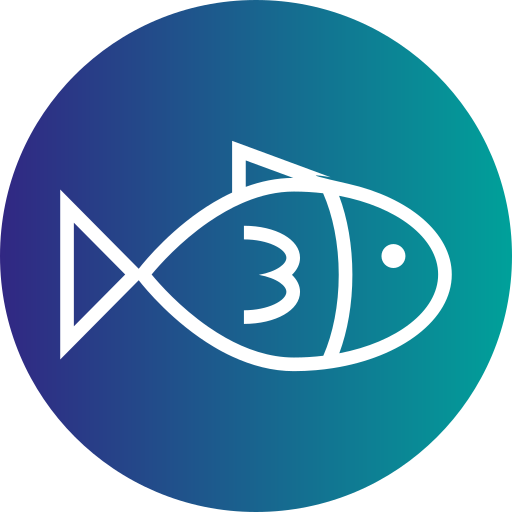
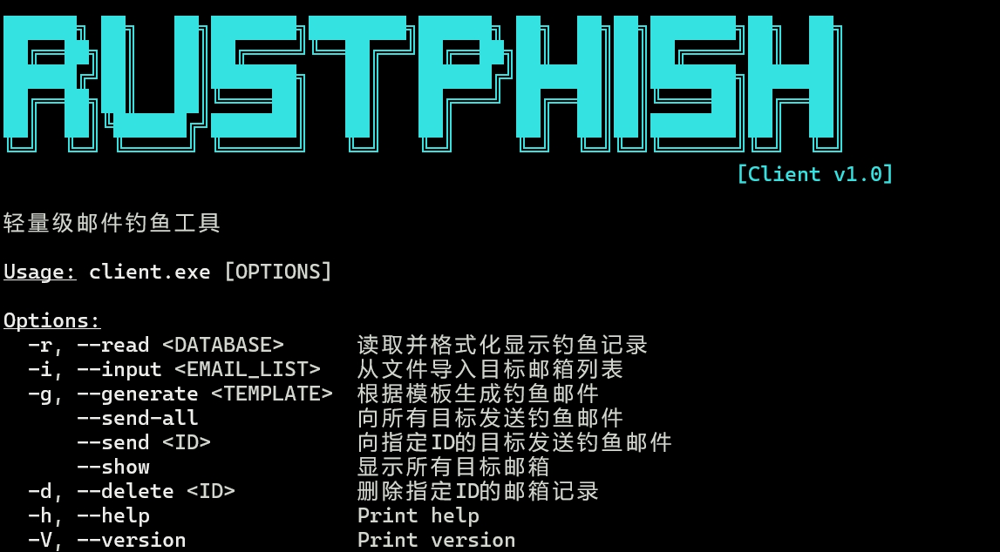
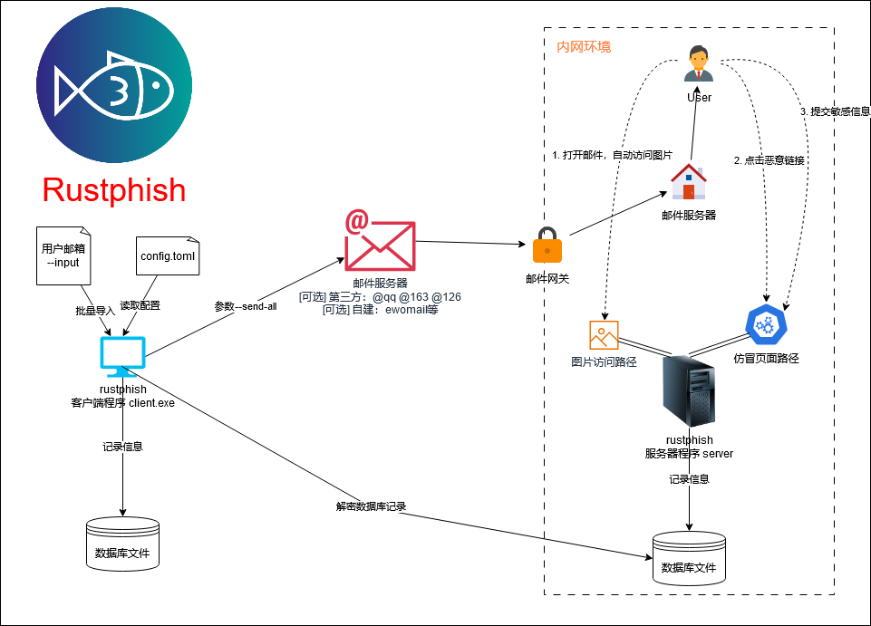

<div align="center">
    <h1>Rustphish</h1>
    
    
    
    
    
    <br>
    <br>
    
</div>

<br/> 
<br/> 

[简体中文](./README.md) | [English](./README_EN.md)
<br/> 

一个client-server分离的轻量化、高效能的钓鱼邮件演练工具，旨在替代`gophish`


---

[目录](#目录)
- [免责声明](#免责声明)
- [Why rustphish?](#why-rustphish)
- [快速开始](#快速开始)
- [项目介绍](#项目介绍)
- [下载](#下载)
- [链接钓鱼/二维码钓鱼](#链接钓鱼二维码钓鱼)
  - [一、搭建服务器](#一搭建服务器)
  - [二、使用客户端发送钓鱼邮件](#二使用客户端发送钓鱼邮件)
  - [三、使用客户端读取服务端的数据库记录](#三使用客户端读取服务端的数据库记录)
- [恶意文件钓鱼](#恶意文件钓鱼)
  - [安装依赖](#安装依赖)
  - [编译模板文件](#编译模板文件)
- [注意事项](#注意事项)
  - [重要文件](#重要文件)
  - [仿冒页面](#仿冒页面)
  - [邮件模板](#邮件模板)
  - [server配置文件](#server配置文件)
  - [client配置文件](#client配置文件)
- [编译](#编译)
- [常见问题](#常见问题)
    - [1. 客户端读取服务端数据库记录，没有成功识别点击链接、木马的受害人](#1-客户端读取服务端数据库记录没有成功识别点击链接木马的受害人)
- [功能实现](#功能实现)
  - [服务端](#服务端)
  - [客户端](#客户端)
  - [其他](#其他)

# 免责声明
本工具仅面向**合法授权**的企业安全建设行为，如您需要测试本工具的可用性，请自行搭建靶机环境。

在使用本工具进行检测时，您应确保该行为符合当地的法律法规，并且已经取得了足够的授权。**请勿对非授权目标进行钓鱼。**

如您在使用本工具的过程中存在任何非法行为，您需自行承担相应后果，我们将不承担任何法律及连带责任。

在安装并使用本工具前，请您**务必审慎阅读、充分理解各条款内容**，限制、免责条款或者其他涉及您重大权益的条款可能会以加粗、加下划线等形式提示您重点注意。 除非您已充分阅读、完全理解并接受本协议所有条款，否则，请您不要安装并使用本工具。您的使用行为或者您以其他任何明示或者默示方式表示接受本协议的，即视为您已阅读并同意本协议的约束。

# Why rustphish?
- 分离式：`client-server`分离式邮件钓鱼平台，解决`gophish`一体化模式下无法完成**内网邮件钓鱼**等操作
- 轻量级：无服务化的轻量级工具，所有记录信息保存为轻量文件，可随意备移动或备份
- 极小的木马：支持附件钓鱼，使用基于`no_std`的`10kb`无害化木马，解决使用`C2工具`钓鱼时的免杀、便捷性、安全性等问题
- 高稳定性：无`unwarp()`代码，在代码层面维护程序不崩溃
- 支持各类型钓鱼：
  - [x] 链接钓鱼
  - [x] EXE文件钓鱼
  - [x] 二维码钓鱼
  - [ ] MSI文件钓鱼
  - [ ] LNK文件钓鱼
  - [ ] Macro钓鱼
  - [ ] .......

# 快速开始
```bash
./bin/client.exe --help
```


# 项目介绍


# 下载
根据操作系统环境，在Github右侧的`Releases`中下载`client`和`server`
> `client_read` 是条件编译的最小客户端，只用于读取数据库，不支持发送邮件。该程序的设计用于面向内网数据库文件不便于传出的场景，可以将该文件传入内网服务器中，直接用于解密数据库记录
> `client_all` 是完整客户端，支持发送邮件

# 链接钓鱼/二维码钓鱼
## 一、搭建服务器
1. 修改配置文件(`server_config.toml`)，详情见[server配置文件](#server配置文件)
2. 添加仿冒页面(`frontend/index.html`)，详情见[仿冒页面](#仿冒页面)
3. 启动服务器(`chmod +x ./server && ./server`)

## 二、使用客户端发送钓鱼邮件
1. 修改配置文件(`client_config.toml`)，详情见[client配置文件](#client配置文件)
2. 导入邮箱: `./client.exe --input xxx.txt`(txt文件格式为每行一个邮箱)。确认邮箱成功导入: `./client.exe --show`
3. 添加邮件模板：详情见[邮件模板](#邮件模板)
4. 发送所有钓鱼邮件: `./client.exe --send-all`

## 三、使用客户端读取服务端的数据库记录
1. 下载服务器目录下的`database`文件
2. `./client.exe --read ./database`: 读取数据库记录（或使用`client_read.exe`）

# 恶意文件钓鱼
## 安装依赖
rustphish依赖下列程序，请下载并添加至环境变量：
- rcedit: [https://github.com/electron/rcedit]
## 编译模板文件
> 仅可于`windows`中进行编译，确保自己有`rust`及`C++桌面开发`环境
1. 修改`appendix\src\main.rs`文件中的IP和端口，指向钓鱼服务器
2. 使用`cargo make appendix`编译，将编译好的文件移动到客户端的`./libs/appendix.exe`
3. `./client.exe --send-all --appendix-exe`: 发送携带exe的钓鱼邮件

# 注意事项
## 重要文件
- `email_database`：受害者邮箱信息和ID，在最初`--input`导入邮箱时，会记录邮箱信息。在发送钓鱼邮件后，**请勿删除**该文件或使用`--delete`删除非测试的邮箱，否则无法解析服务端数据库记录。**建议备份保存**
- `database`：服务端数据库，在发送钓鱼邮件后，请勿删除该文件，否则无法读取受害人访问记录。**建议备份保存**
## 仿冒页面
下方为最简化的仿冒页面，建议使用`form`和`input`标签完成提交功能，目的是将数据通过`POST`包提交到`{{submit}}`接口
```html
<!DOCTYPE html>
<html>
<head>
    <title>Dynamic Form</title>
</head>
<body>
    <!-- 重要部分 -->
    <form action="{{submit}}" method="post">
        <input type="text" name="key1"><br>
        <input type="text" name="key2"><br>
        <input type="text" name="key3"><br>
        <button type="submit">Submit</button>
    </form>
</body>
</html>
```

## 邮件模板
参考下方邮件模板，在邮件html文件的特定位置写入`{{index}}`、`{{qrcode}}`、`{{image}}`

```html
<html><head>
......
点击下方链接，完成测试： <a href="{{index}}">{{index}}</a>
如果需要二维码钓鱼，添加标签：
 <!-- 用于记录受害者是否打开邮件 -->
</body></html>
```

## server配置文件
```toml
[server]
ip = "0.0.0.0" #服务端监听ip
port = 8080 #服务端端口

[paths]
phish_page = "./frontend/test.html" #仿冒页面路径
redirect_url = "http://localhost:8080/success" #提交成功后，重定向的url
success_page = "./frontend/success.html" #路由`/success`下的成功页面路径，可以用于`paths.redirect_url`重定向
```

## client配置文件
```toml
[server]
ip_or_domain = "teamserver.com"
port = 80

[smtp]
server = "smtp.126.com" #smtp服务器地址
username = "xxx@126.com" #smtp服务器用户名
from_email = "Test <xxx@126.com>" #发件人邮箱
subject = "Test Subject" #邮件主题
interval = 5 #每封邮件间隔时间

[email]
template = "template.html" #邮件模板路径
original_appendix_path_exe = "./appendix.exe"
appendix_name_for_sending_exe = "xxx"
original_appendix_path_lnk = "./appendix.lnk"
appendix_name_for_sending_lnk = "xxx"
zip_name = "xxx"
```


# 编译
如需自行编译，按如下方式操作

```bash
cargo build --release -p client --features db
cargo build --release -p client --all-features
cargo build --release -p server
```

# 常见问题
### 1. 客户端读取服务端数据库记录，没有成功识别点击链接、木马的受害人
确保`client.exe`成功导入了邮箱: 在相同目录下存在`./email_database`。使用命令`./client.exe --show`确认邮箱成功导入

# 功能实现
## 服务端
- [x] 链接识别接口
- [x] 图片识别接口
- [x] 配置文件化
- [x] 无unwrap，确保稳定性
- [ ] ~~钓鱼链接特征可控化~~ (为配置文件引入额外的复杂度，不利于实际应用)

## 客户端
- [x] 目标导入及存储
- [x] 钓鱼邮件生成
- [x] 读取服务端数据库
- [x] smtp邮件发送
- [x] 附件钓鱼功能(exe)
- [x] 二维码钓鱼功能
- [ ] https

- [ ] exe自动加图标
- [ ] exe自动打包zip
- [ ] 附件钓鱼功能(zip)
- [ ] zip & random_password

- [ ] 附件钓鱼功能(lnk)
- [ ] 附件钓鱼功能(msi)
- [ ] 附件钓鱼功能(macro)

## 其他
- [ ] 修改结构体，添加邮件人ID
